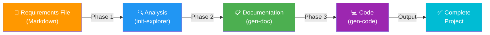

# Claude Gen Plugin - Product Overview

**What is Claude Gen?** The intelligent code generation and documentation platform that transforms requirements into complete project structure, professional documentation, and production-ready code scaffolding.

---

## The Problem It Solves

### Before Claude Gen ❌
```
Requirements Document
        ↓
    [MANUAL WORK]
        ↓
    Create BRD (Business Requirements Document) ← 4-6 hours
    Create PRD (Product Requirements Document) ← 4-6 hours
    Create SRS (Technical Specification) ← 4-6 hours
    Create UI Mockups (per screen) ← 2-4 hours per screen
    Create API Contracts ← 2-4 hours per module
    Setup project structure ← 2-4 hours
    Generate boilerplate code ← 4-8 hours
        ↓
    Total: 30-50+ HOURS for a medium project
        ↓
    Code that still needs significant customization
```

### With Claude Gen ✅
```
Requirements Document (Markdown)
        ↓
    [AUTOMATED]
        ↓
    /claude-gen:generate requirements.md
        ↓
    ✅ BRD generated automatically (estimated)
    ✅ PRD generated automatically (estimated)
    ✅ SRS generated automatically (estimated)
    ✅ UI Mockups per screen (estimated)
    ✅ API Contracts per module (estimated)
    ✅ Project structure created (estimated)
    ✅ Code scaffolding generated (estimated)
        ↓
    Estimated total: 30-40 minutes for a medium project
        ↓
    Professional documentation + Code ready for review
    
    TIME SAVED: estimate 20-40+ hours depending on project complexity
```

---

## How It Works

### The 3-Phase Pipeline



### Phase 1️⃣: Initialization & Exploration (init-explorer)
**Duration**: 3-5 minutes  
**Input**: Requirements file + Existing codebase (if any)  
**Output**: **Analysis documents**

Does one of two things:

**A. Init Mode** (New Project):
```
✅ Detect tech stack from requirements
✅ Scaffold project directory structure
✅ Initialize git repository
✅ Create base configuration files
```

**B. Explorer Mode** (Existing Project):
```
✅ Analyze frontend architecture (components, routing, state management)
✅ Analyze backend architecture (models, services, API patterns)
✅ Document code conventions (style, naming, imports)
✅ Identify tech stack (frameworks, libraries, tools)
```

**Output files** (.generated/analysis/):
- `project-overview.md` - Directory structure
- `frontend-structure.md` - FE patterns and conventions
- `backend-structure.md` - BE patterns and conventions  
- `tech-stack.md` - Technologies used
- `conventions.md` - Code style guide

---

### Phase 2️⃣: Document Generation (gen-doc)
**Duration**: 5-8 minutes  
**Input**: Requirements file + Project analysis  
**Output**: **Professional documentation + UI mockups + API contracts**

Generates all project documentation:

#### BRD (Business Requirements Document)
- Executive summary with vision
- Business objectives and KPIs
- Stakeholder analysis
- Market analysis
- User personas
- Business requirements (BR-001, BR-002, ...)
- Financial projections
- Risk assessment

#### PRD (Product Requirements Document)
- Product overview
- Problem statement
- Target users
- Success metrics
- User stories (US-001, US-002, ...) with acceptance criteria
- Feature requirements by module
- Non-functional requirements
- Out of scope items
- Delivery phasing

#### SRS (Software Requirements Specification)
- System architecture diagram
- Frontend technical specifications
- Backend technical specifications
- Database schema
- API architecture
- Security design
- Error handling strategy
- Performance requirements

#### UI Mockups (Per Screen)
For each screen in the application:
```
✅ Screen flow diagram (how to navigate to this screen)
✅ Component tree (what components make up the screen)
✅ Layout (ASCII wireframes for desktop/tablet/mobile)
✅ Component specifications (which UI elements, properties)
✅ State management design
✅ API calls and integrations
✅ User interaction flows
✅ Validation rules
✅ Error states and handling
```

Example: Task Management System has 8 screens:
- Login Screen → Complete mockup
- Dashboard → Complete mockup
- Projects List → Complete mockup
- Project Detail → Complete mockup
- Task Board (Kanban) → Complete mockup
- Task Detail → Complete mockup
- User Settings → Complete mockup
- Notifications → Complete mockup

#### API Contracts (Per Module)
For each backend module:
```
✅ Base path and authentication
✅ Common request/response format
✅ Each endpoint specification:
   - Method (GET, POST, PUT, DELETE, PATCH)
   - Path and parameters
   - Request body (JSON schema)
   - Response body (examples + schema)
   - Status codes and error responses
   - Rate limiting
   - Example curl commands
✅ Validation rules
✅ Error scenarios
```

**Output files** (.generated/docs/):
```
.generated/docs/
├── BRD.md                    ← Business Requirements
├── PRD.md                    ← Product Requirements
├── SRS.md                    ← Technical Specification
├── ui-mockups/
│   ├── screen-login.md
│   ├── screen-dashboard.md
│   ├── screen-project-list.md
│   └── ... (one for each screen)
└── api-contracts/
    ├── auth.md               ← Authentication APIs
    ├── projects.md           ← Project management APIs
    ├── tasks.md              ← Task management APIs
    └── ... (one for each module)
```

---

### Phase 3️⃣: Code Generation (gen-code)
**Duration**: 10-15 minutes  
**Input**: Requirements + Documentation + Code analysis  
**Output**: **Generated source code files**

Generates production-ready code scaffolding:

#### Frontend Code
```
✅ Component files (React, Vue, or framework of choice)
   - Per-screen components with hooks
   - Form components with validation
   - UI components with proper styling
✅ API client/service files
   - Typed API calls
   - Request/response handling
✅ State management
   - Zustand stores / Redux slices / Pinia stores
✅ Type definitions
   - TypeScript interfaces
   - Zod schemas
   - Form types
✅ Page/route files
   - Page structure matching routing spec
   - Layout components
   - Auth guards
```

#### Backend Code
```
✅ Model/Entity files
   - Database entities
   - Validation decorators
   - Type definitions
✅ Service/Business logic files
   - CRUD operations
   - Business rules
   - Error handling
✅ Controller/Handler files
   - API endpoints
   - Request validation
   - Response formatting
✅ Route definitions
   - Endpoint routing
   - Middleware setup
   - Auth integration
✅ Configuration files
   - Database configuration
   - Environment setup
   - Security headers
```

**Code Quality**:
- ✅ Follows existing code conventions
- ✅ Proper error handling
- ✅ Type-safe (TypeScript, Python type hints)
- ✅ Well-documented (JSDoc, docstrings)
- ✅ Ready for review (not production-deploy)

---

## Input: The Requirements File

A simple Markdown file that describes what you want to build:

```markdown
# Task Management System

## Mô tả
Team task management platform for agile teams.

## Business Context
- **Business Problem**: Teams use email/spreadsheet causing chaos
- **Target Users**: Project Managers, Team Members, Stakeholders
- **Business Goals**: Increase productivity 40%, reduce sync meetings 60%

## Features
### Authentication & Authorization
- Email/password signup
- JWT-based login
- Role-based access (Admin, PM, Member)

### Project Management
- Create/edit projects
- Add team members
- Archive projects

### Task Management
- Create tasks with title, description, assignee, deadline, priority
- Drag & drop Kanban board
- Comments and attachments
- Filter and sort tasks

### Dashboard
- Task overview (total, on-time, overdue)
- Statistics (by status, priority)
- Notifications

## Tech Stack
- Frontend: Next.js 14, TypeScript, Tailwind CSS, shadcn/ui
- Backend: NestJS, PostgreSQL, Prisma
- Real-time: Socket.io

## Screens
- Login
- Dashboard
- Projects List
- Project Detail
- Task Board (Kanban)
- Task Detail
- Settings

## API Modules
- Auth
- Projects
- Tasks
- Users
- Notifications
```

That's it! Just describe your project in simple terms.

---

## Output: Complete Project

After running Claude Gen, you get:

```
📁 Your Project Root
│
├─ 📁 .generated/              [All artifacts]
│  ├─ 📁 analysis/
│  │  ├─ project-overview.md
│  │  ├─ frontend-structure.md
│  │  ├─ backend-structure.md
│  │  ├─ tech-stack.md
│  │  ├─ conventions.md
│  │  └─ manifest.json
│  │
│  ├─ 📁 docs/                 [Professional docs]
│  │  ├─ BRD.md                [Business Requirements]
│  │  ├─ PRD.md                [Product Requirements]
│  │  ├─ SRS.md                [Technical Specification]
│  │  ├─ ui-mockups/           [Per-screen mockups]
│  │  │  ├─ screen-login.md
│  │  │  ├─ screen-dashboard.md
│  │  │  └─ ...
│  │  ├─ api-contracts/        [API specifications]
│  │  │  ├─ auth.md
│  │  │  ├─ projects.md
│  │  │  └─ ...
│  │  └─ manifest.json
│  │
│  ├─ 📁 code/                 [Generated source code]
│  │  └─ manifest.json
│  │
│  └─ dependencies.json        [Required packages]
│
├─ 📁 src/                      [Generated project code]
│  ├─ 📁 frontend/
│  │  ├─ components/
│  │  ├─ pages/
│  │  ├─ hooks/
│  │  ├─ services/
│  │  ├─ types/
│  │  └─ ...
│  │
│  └─ 📁 backend/
│     ├─ src/
│     │  ├─ modules/
│     │  ├─ services/
│     │  ├─ controllers/
│     │  ├─ entities/
│     │  └─ ...
│     ├─ package.json
│     └─ ...
│
├─ 📁 .git/                     [Git repository initialized]
├─ package.json                 [Project dependencies]
└─ README.md                    [Project documentation]
```

---

## Key Benefits

### 1. **Speed** ⚡
- 30-40 minutes vs 30-40 hours
- 50-80% faster project initiation
- Parallel documentation generation

### 2. **Completeness** 📚
- Not just code, but full documentation
- BRD (business), PRD (product), SRS (technical)
- UI mockups for every screen
- API contracts for every module

### 3. **Quality** ✅
- Follows your existing code conventions
- Properly typed (TypeScript, Python type hints)
- Consistent error handling
- Well-structured and documented

### 4. **Safety** 🛡️
- Non-destructive (doesn't overwrite existing files)
- Git checkpoints for rollback
- Manifest validation between phases
- Easy recovery from errors

### 5. **Flexibility** 🎯
- Incremental execution (run phases separately)
- Works with new or existing projects
- Customizable requirements format
- Supports multiple frameworks

---

## Supported Frameworks

### Frontend
```
✅ React 16+ (create-react-app, Vite)
✅ Next.js 13+
✅ Vue 3+
✅ Nuxt 3+
✅ Svelte
✅ Angular
```

### Backend
```
✅ Node.js (Express, Nest, Fastify, Hono)
✅ Python (FastAPI, Django, Flask)
✅ Go
✅ Rust (Actix, Tokio)
✅ Java (Spring)
```

### Databases
```
✅ PostgreSQL
✅ MongoDB
✅ MySQL
✅ SQLite
✅ Firebase
```

---

## Real Example: Task Management System

**Input**: Single Markdown file (shown earlier)

**Output** (30-40 minutes):
- ✅ BRD.md (Executive summary, business goals, stakeholders)
- ✅ PRD.md (User stories, features, success metrics)
- ✅ SRS.md (Technical architecture, database schema)
- ✅ 8 UI Mockups (one per screen with layouts)
- ✅ 4 API Contracts (Auth, Projects, Tasks, Users)
- ✅ Generated React/Next.js frontend code
- ✅ Generated NestJS backend code
- ✅ Database models and migrations
- ✅ Type definitions and validations
- ✅ Project structure and configuration

**Time Saved**: 30+ hours  
**Quality**: Professional documentation + production-ready scaffolding  
**Next Step**: Review → Customize → Deploy

---

## Comparison: Manual vs Automated

| Task | Manual Time | Claude Gen | Time Saved |
|------|------------|-----------|-----------|
| BRD creation | 4-6 hours | 3 min | 4.5 hours |
| PRD creation | 4-6 hours | 3 min | 4.5 hours |
| SRS creation | 4-6 hours | 3 min | 4.5 hours |
| UI Mockups (8 screens) | 2-4 hours/screen (16-32 hours) | 5 min | 16-32 hours |
| API Contracts (4 modules) | 2-4 hours/module (8-16 hours) | 5 min | 8-16 hours |
| Project Setup | 2-4 hours | 2 min | 2-4 hours |
| Code Scaffolding | 4-8 hours | 10 min | 4-8 hours |
| **TOTAL (estimated)** | **42-72 hours** | **30-40 minutes** | **40-70 hours** |

**Your team gains**: 40+ billable hours per project  
**Assuming $100/hour developer**: $4,000+ value per project  
**On 10 projects/year**: $40,000+ value

---

## Success Metrics

### For Development Teams
✅ Time to scaffolding: 30-40 min (vs 30+ hours)  
✅ Documentation quality: Professional  
✅ Code consistency: Follows conventions  
✅ Faster code review: Clear specifications

### For Project Managers
✅ Clear requirements documentation  
✅ Visual UI mockups for stakeholders  
✅ API specifications for validation  
✅ Product timeline clarity

### For Stakeholders
✅ Professional documentation  
✅ Visual mockups for feedback  
✅ Clear API contracts  
✅ Faster timeline to MVP

---

## Getting Started

### Basic Usage
```bash
# Generate entire project (all 3 phases)
/claude-gen:generate requirements.md

# Or run phases individually
/claude-gen:generate requirements.md --phase init     # Phase 1: Analysis
/claude-gen:generate requirements.md --phase docs     # Phase 2: Docs
/claude-gen:generate requirements.md --phase code     # Phase 3: Code
```

### Next Steps
1. Write a `requirements.md` file describing your project
2. Run `/claude-gen:generate requirements.md`
3. Review generated documentation in `.generated/docs/`
4. Review generated code in project structure
5. Customize and extend as needed

---

## What's Next?

Claude Gen Plugin is your AI-powered development assistant:
- From idea → Complete documentation → Code scaffolding
- In minutes instead of days
- With professional quality
- Ready for team review

🚀 **Transform your development workflow today!**

