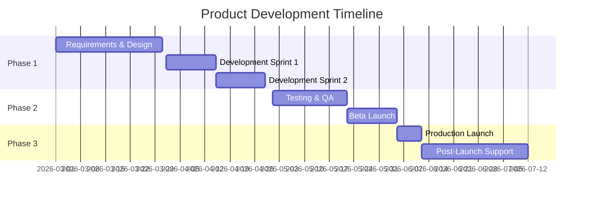

# BRD: [Product Name]

> Business Requirements Document  
> Generated by Claude Gen Plugin — [Date]

---

## Executive Summary

### Product Vision
[1-2 paragraph high-level vision statement for the product]

### Business Problem
[What business problem or opportunity does this product address?]

### Strategic Alignment
[How does this product align with company strategy and goals?]

---

## Business Objectives

### Primary Objectives
| Objective | Description | Target Metric | Timeline |
|-----------|-------------|--------------|----------|
| [Objective 1] | [Description] | [Metric with target value] | [Q1 2026] |
| [Objective 2] | [Description] | [Metric with target value] | [Q2 2026] |
| [Objective 3] | [Description] | [Metric with target value] | [Q3 2026] |

### Success Criteria
- [ ] [Measurable criterion 1]
- [ ] [Measurable criterion 2]
- [ ] [Measurable criterion 3]

---

## Stakeholders

### Primary Stakeholders
| Name/Role | Department | Responsibility | Contact |
|-----------|-----------|----------------|---------|
| [Name] | [Department] | [Sponsor/Owner/Reviewer] | [email] |
| [Name] | [Department] | [Key User/Decision Maker] | [email] |

### Secondary Stakeholders
- [Role/Department]: [Interest/Involvement]
- [Role/Department]: [Interest/Involvement]

---

## Market Analysis

### Target Market
| Segment | Description | Size | Priority |
|---------|-------------|------|----------|
| [Segment 1] | [Description] | [Market size estimate] | High/Medium/Low |
| [Segment 2] | [Description] | [Market size estimate] | High/Medium/Low |

### Competitive Landscape
| Competitor | Strengths | Weaknesses | Opportunity |
|------------|-----------|------------|-------------|
| [Competitor 1] | [Key strengths] | [Gaps we can exploit] | [Our advantage] |
| [Competitor 2] | [Key strengths] | [Gaps we can exploit] | [Our advantage] |

### Market Need
[Describe the unmet need or pain point in the market]

---

## User Personas

### Persona 1: [Name]
**Demographics**: [Age, location, occupation, etc.]  
**Goals**: 
- [Goal 1]
- [Goal 2]

**Pain Points**:
- [Pain point 1]
- [Pain point 2]

**Expected Value**: [What they get from this product]

---

### Persona 2: [Name]
**Demographics**: [Age, location, occupation, etc.]  
**Goals**:
- [Goal 1]
- [Goal 2]

**Pain Points**:
- [Pain point 1]
- [Pain point 2]

**Expected Value**: [What they get from this product]

---

## Business Requirements

### BR-001: [Requirement Name]
**Category**: [Revenue/Efficiency/Compliance/Experience]  
**Priority**: P1 | P2 | P3  
**Description**: [What business capability is needed]  
**Business Value**: [Why this matters to the business]  
**Related User Personas**: [Which personas benefit]

---

### BR-002: [Requirement Name]
**Category**: [Revenue/Efficiency/Compliance/Experience]  
**Priority**: P1 | P2 | P3  
**Description**: [What business capability is needed]  
**Business Value**: [Why this matters to the business]  
**Related User Personas**: [Which personas benefit]

---

<!-- Repeat for all business requirements -->

---

## Scope

### In Scope (MVP)
- [Feature/Capability 1]
- [Feature/Capability 2]
- [Feature/Capability 3]

### In Scope (Post-MVP)
- [Feature/Capability 4]
- [Feature/Capability 5]

### Out of Scope
- [Explicitly excluded feature/capability 1]
- [Explicitly excluded feature/capability 2]

---

## Financial Analysis

### Investment Required
| Category | Cost Estimate | Timeline |
|----------|--------------|----------|
| Development | $[amount] | [months] |
| Infrastructure | $[amount]/year | Ongoing |
| Marketing/Launch | $[amount] | [months] |
| Support/Maintenance | $[amount]/year | Ongoing |
| **Total Year 1** | **$[total]** | |

### Expected Revenue/Savings
| Revenue Stream | Year 1 | Year 2 | Year 3 |
|----------------|--------|--------|--------|
| [Stream 1] | $[amt] | $[amt] | $[amt] |
| [Stream 2] | $[amt] | $[amt] | $[amt] |
| **Total** | **$[total]** | **$[total]** | **$[total]** |

### ROI Analysis
- **Break-even**: [Month/Quarter]
- **3-Year ROI**: [Percentage]
- **Payback Period**: [Months]

---

## Risks and Mitigation

| Risk | Probability | Impact | Mitigation Strategy |
|------|------------|--------|-------------------|
| [Risk 1] | High/Med/Low | High/Med/Low | [How to mitigate] |
| [Risk 2] | High/Med/Low | High/Med/Low | [How to mitigate] |
| [Risk 3] | High/Med/Low | High/Med/Low | [How to mitigate] |

---

## Assumptions and Constraints

### Assumptions
- [Assumption 1]
- [Assumption 2]
- [Assumption 3]

### Constraints
- **Budget**: $[amount] maximum
- **Timeline**: Launch by [date]
- **Resources**: [team size, technology constraints]
- **Regulatory**: [compliance requirements]

---

## Implementation Timeline

### Milestone Plan

### Phase Deliverables
| Phase | Duration | Key Deliverables |
|-------|----------|-----------------|
| Phase 1: Planning | [weeks] | BRD, PRD, SRS, Technical Design |
| Phase 2: Development | [weeks] | MVP Feature Set, API, Frontend |
| Phase 3: Testing | [weeks] | QA Complete, Bug Fixes, Performance Tuning |
| Phase 4: Launch | [weeks] | Production Deployment, Documentation, Training |
| Phase 5: Post-Launch | [weeks] | Monitoring, Support, Initial Improvements |

---

## Success Metrics & KPIs

### Launch Metrics (First 90 Days)
| Metric | Target | Measurement Method |
|--------|--------|-------------------|
| User Acquisition | [number] users | Analytics platform |
| Activation Rate | [percentage]% | Users completing onboarding |
| Daily Active Users (DAU) | [number] | Analytics platform |
| Customer Satisfaction | [score/5] | NPS or CSAT survey |

### Long-term Metrics (6-12 Months)
| Metric | 6-Month Target | 12-Month Target |
|--------|---------------|-----------------|
| Monthly Recurring Revenue | $[amount] | $[amount] |
| User Retention Rate | [percentage]% | [percentage]% |
| Customer Lifetime Value | $[amount] | $[amount] |
| Market Share | [percentage]% | [percentage]% |

---

## Dependencies

### Internal Dependencies
- [Dependency 1]: [Description, owner]
- [Dependency 2]: [Description, owner]

### External Dependencies
- [Dependency 1]: [Description, vendor/partner]
- [Dependency 2]: [Description, vendor/partner]

---

## Approval and Sign-off

| Stakeholder | Role | Signature | Date |
|-------------|------|-----------|------|
| [Name] | Executive Sponsor | | |
| [Name] | Product Owner | | |
| [Name] | Technical Lead | | |
| [Name] | Finance Approval | | |

---

## Appendix

### Glossary
- **[Term]**: [Definition]
- **[Term]**: [Definition]

### References
- [Document/Research 1]
- [Document/Research 2]

### Change Log
| Version | Date | Author | Changes |
|---------|------|--------|---------|
| 1.0 | [Date] | [Name] | Initial version |
