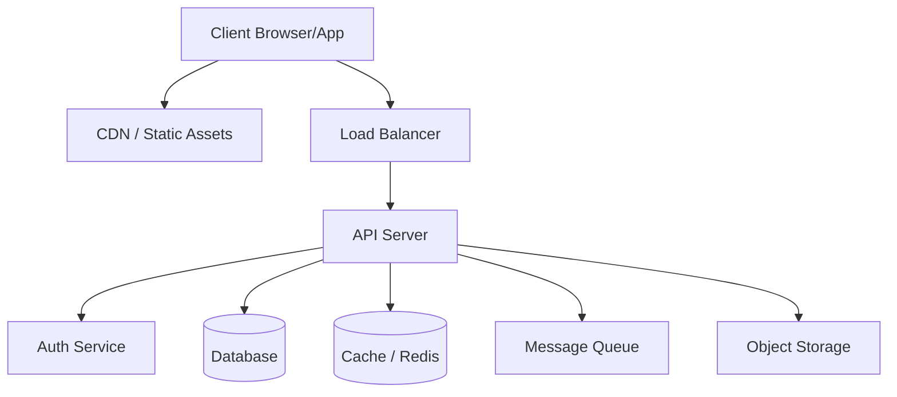
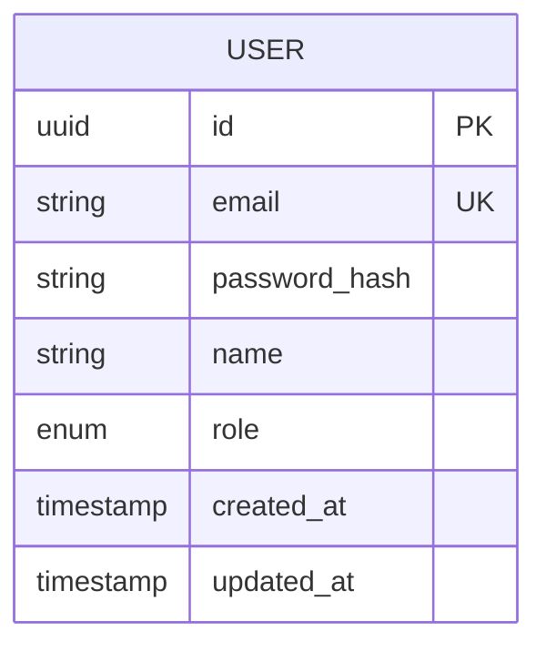
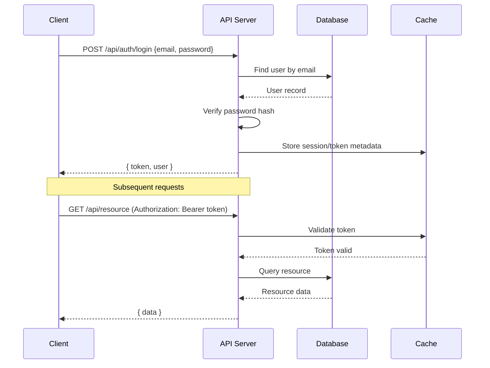
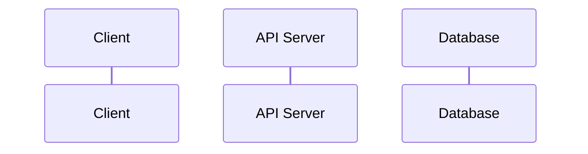

# SRS: [Product Name]

> Generated by Claude Gen Plugin — [Date]

---

## 1. System Architecture

### 1.1 Architecture Overview



### 1.2 Component Overview

| Component | Technology | Responsibility |
|-----------|-----------|----------------|
| Frontend | [Framework] | User interface, client-side logic |
| API Server | [Framework] | Business logic, request handling |
| Database | [Database] | Data persistence |
| Cache | [Redis/Memcached] | Session storage, data caching |
| Auth | [Strategy] | Authentication & authorization |

### 1.3 Integration Points

| Source | Target | Protocol | Description |
|--------|--------|----------|-------------|
| Frontend | API | REST/GraphQL | Primary data exchange |
| API | Database | TCP | Data persistence |
| API | Cache | TCP | Caching layer |

---

## 2. Frontend Specification

### 2.1 Tech Stack

| Category | Technology | Version |
|----------|-----------|---------|
| Framework | [Next.js/React/Vue] | [version] |
| Language | [TypeScript] | [version] |
| Styling | [Tailwind/CSS Modules] | [version] |
| State Mgmt | [Zustand/Redux/Pinia] | [version] |
| HTTP Client | [Axios/fetch/ky] | [version] |
| Form Handling | [React Hook Form/Formik] | [version] |
| Validation | [Zod/Yup] | [version] |

### 2.2 Screen Map

| Screen | Route | Auth Required | Description |
|--------|-------|--------------|-------------|
| [Screen 1] | /path | Yes/No | [Description] |
| [Screen 2] | /path | Yes/No | [Description] |

> Detailed screen specs: see `ui-mockups/screen-<name>.md`

### 2.3 Component Hierarchy

```
App
├── Layout
│   ├── Header
│   │   ├── Logo
│   │   ├── Navigation
│   │   └── UserMenu
│   ├── Sidebar (optional)
│   └── Footer
├── Pages
│   ├── [Screen1Page]
│   │   ├── [Component A]
│   │   └── [Component B]
│   └── [Screen2Page]
│       ├── [Component C]
│       └── [Component D]
└── Shared
    ├── Button
    ├── Input
    ├── Modal
    ├── Table
    └── Toast
```

### 2.4 State Management Design

| Store/Slice | State Shape | Actions | Used By |
|-------------|------------|---------|---------|
| authStore | `{ user, token, isLoading }` | login, logout, refresh | Header, Guards |
| [store] | `{ ... }` | [actions] | [components] |

### 2.5 Client-Side Routing

```
/                     → Home / Landing
/login                → Login
/register             → Registration
/dashboard            → Dashboard (auth required)
/[resource]           → Resource list
/[resource]/:id       → Resource detail
/[resource]/:id/edit  → Resource edit
/settings             → User settings
/404                  → Not found
```

---

## 3. Backend Specification

### 3.1 Tech Stack

| Category | Technology | Version |
|----------|-----------|---------|
| Framework | [NestJS/Express/FastAPI] | [version] |
| Language | [TypeScript/Python/Go] | [version] |
| ORM | [Prisma/TypeORM/SQLAlchemy] | [version] |
| Database | [PostgreSQL/MongoDB] | [version] |
| Auth | [JWT/Passport/OAuth] | [version] |
| Validation | [class-validator/Zod/Pydantic] | [version] |

### 3.2 Module Breakdown

| Module | Responsibility | Dependencies |
|--------|---------------|-------------|
| Auth | Authentication, authorization | User |
| User | User management, profiles | - |
| [Module] | [Responsibility] | [Dependencies] |

> Detailed API specs: see `api-contracts/<module>.md`

### 3.3 API Endpoint Summary

| Method | Path | Auth | Module | Description |
|--------|------|------|--------|-------------|
| POST | /api/auth/login | Public | Auth | User login |
| POST | /api/auth/register | Public | Auth | User registration |
| GET | /api/users/me | Required | User | Get current user |
| [METHOD] | [path] | [auth] | [module] | [description] |

### 3.4 Database Schema



### 3.5 Business Logic Rules

#### Module: [Module Name]

| Rule ID | Rule | Enforcement |
|---------|------|-------------|
| BL-001 | [Business rule description] | [Service/Middleware/DB constraint] |
| BL-002 | [Business rule description] | [Service/Middleware/DB constraint] |

---

## 4. Data Flow

### 4.1 Authentication Flow



### 4.2 [Key Feature] Flow



---

## 5. Error Handling

### 5.1 Error Response Format

```json
{
  "success": false,
  "error": {
    "code": "ERROR_CODE",
    "message": "Human-readable error message",
    "details": [
      {
        "field": "fieldName",
        "message": "Specific field error"
      }
    ]
  }
}
```

### 5.2 Error Code Taxonomy

| HTTP Status | Error Code | Description |
|------------|------------|-------------|
| 400 | VALIDATION_ERROR | Request validation failed |
| 401 | UNAUTHORIZED | Authentication required |
| 403 | FORBIDDEN | Insufficient permissions |
| 404 | NOT_FOUND | Resource not found |
| 409 | CONFLICT | Resource conflict (duplicate) |
| 422 | UNPROCESSABLE | Business logic validation failed |
| 429 | RATE_LIMITED | Too many requests |
| 500 | INTERNAL_ERROR | Unexpected server error |

### 5.3 Client-Side Error Handling

| Error Type | Display Strategy | User Action |
|-----------|-----------------|-------------|
| Validation (400) | Inline field errors | Fix and retry |
| Auth (401) | Redirect to login | Re-authenticate |
| Permission (403) | Toast notification | Contact admin |
| Not Found (404) | 404 page | Navigate back |
| Server (500) | Toast with retry | Retry or report |

---

## 6. Security Specification

### 6.1 Authentication
- Strategy: [JWT Bearer / Session / OAuth 2.0]
- Token expiry: [Access: 15min, Refresh: 7d]
- Storage: [httpOnly cookie / secure localStorage]

### 6.2 Authorization
- Model: [RBAC / ABAC]
- Roles: [Admin, User, Guest, ...]
- Permission matrix:

| Resource | Admin | User | Guest |
|----------|-------|------|-------|
| [Resource] | CRUD | R | - |

### 6.3 Data Protection
- Passwords: bcrypt (cost factor 12)
- Sensitive data: AES-256 at rest
- Transport: TLS 1.3 (HTTPS only)
- PII handling: [strategy]

### 6.4 Input Validation
- All inputs validated server-side (framework validation layer)
- SQL injection prevention via parameterized queries (ORM)
- XSS prevention via output encoding
- CSRF protection via [tokens / SameSite cookies]
- Rate limiting: [strategy]

---

## Appendix

### A. Environment Variables

| Variable | Description | Required | Default |
|----------|-------------|----------|---------|
| DATABASE_URL | Database connection string | Yes | - |
| JWT_SECRET | JWT signing secret | Yes | - |
| PORT | Server port | No | 3000 |
| NODE_ENV | Environment | No | development |

### B. Third-Party Services

| Service | Purpose | Documentation |
|---------|---------|--------------|
| [Service] | [Purpose] | [URL] |
