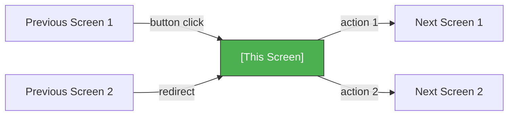
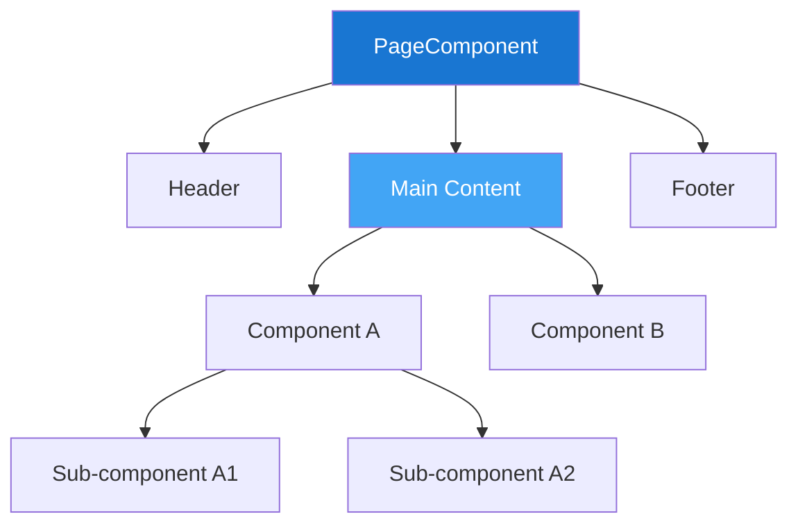

# Screen: [Screen Name]

> Generated by Claude Gen Plugin — [Date]
> Referenced by: PRD [US-XXX], SRS Section [X.X]

## Screen Flow



## Component Tree



## Route
`/[route-path]`

## Auth Required
[Yes / No] — [Redirect to /login if unauthenticated]

---

## Layout

### Desktop (≥1024px)

```
┌─────────────────────────────────────────────────────────┐
│  [Header / Navigation Bar]                              │
├────────────┬────────────────────────────────────────────┤
│            │                                            │
│  Sidebar   │        Main Content Area                   │
│  (optional)│                                            │
│            │   ┌────────────────────────────────────┐   │
│  - Nav 1   │   │                                    │   │
│  - Nav 2   │   │   [Component A]                    │   │
│  - Nav 3   │   │                                    │   │
│            │   └────────────────────────────────────┘   │
│            │                                            │
│            │   ┌────────────────────────────────────┐   │
│            │   │                                    │   │
│            │   │   [Component B]                    │   │
│            │   │                                    │   │
│            │   └────────────────────────────────────┘   │
│            │                                            │
├────────────┴────────────────────────────────────────────┤
│  [Footer]                                               │
└─────────────────────────────────────────────────────────┘
```

### Tablet (768px–1023px)

```
┌──────────────────────────────────┐
│  [Header]              [☰ Menu] │
├──────────────────────────────────┤
│                                  │
│  ┌────────────────────────────┐  │
│  │  [Component A]             │  │
│  └────────────────────────────┘  │
│                                  │
│  ┌────────────────────────────┐  │
│  │  [Component B]             │  │
│  └────────────────────────────┘  │
│                                  │
├──────────────────────────────────┤
│  [Footer]                        │
└──────────────────────────────────┘
```

### Mobile (<768px)

```
┌────────────────────────┐
│  [☰]  Logo     [User]  │
├────────────────────────┤
│                        │
│  ┌──────────────────┐  │
│  │ [Component A]    │  │
│  └──────────────────┘  │
│                        │
│  ┌──────────────────┐  │
│  │ [Component B]    │  │
│  └──────────────────┘  │
│                        │
├────────────────────────┤
│ [Tab1] [Tab2] [Tab3]   │
└────────────────────────┘
```

---

## Components

| Component | Type | Description | Key Props |
|-----------|------|-------------|-----------|
| [ComponentA] | [Form / List / Card / Table / Modal] | [What it does] | [key props with types] |
| [ComponentB] | [Form / List / Card / Table / Modal] | [What it does] | [key props with types] |

### Component Details

#### [ComponentA]
- **Type**: [Form / DataTable / Card / ...]
- **Children**: [Sub-components if any]
- **Behavior**:
  - [Behavior 1]
  - [Behavior 2]

---

## State

| State Key | Type | Default | Description |
|-----------|------|---------|-------------|
| isLoading | `boolean` | `false` | Page/section loading state |
| data | `T[]` | `[]` | Primary data for this screen |
| error | `string \| null` | `null` | Error message display |
| selectedId | `string \| null` | `null` | Currently selected item |
| filters | `FilterState` | `{}` | Active filters |
| pagination | `{ page: number, limit: number }` | `{ page: 1, limit: 20 }` | Pagination state |

---

## API Calls

| Action | Method | Endpoint | Request Body | Response | Trigger |
|--------|--------|----------|-------------|----------|---------|
| Load data | GET | `/api/[resource]` | — | `{ data: T[], total: number }` | Page mount |
| Create item | POST | `/api/[resource]` | `{ field: value }` | `{ data: T }` | Form submit |
| Update item | PATCH | `/api/[resource]/:id` | `{ field: value }` | `{ data: T }` | Form submit |
| Delete item | DELETE | `/api/[resource]/:id` | — | `{ success: true }` | Confirm dialog |

---

## User Interactions

| # | User Action | System Response | Navigation |
|---|------------|-----------------|------------|
| 1 | [Clicks button / Submits form / ...] | [API call / State change / Animation] | [Stay / Navigate to /path] |
| 2 | [Scrolls to bottom] | [Load more data (infinite scroll)] | Stay |
| 3 | [Clicks filter] | [Re-fetch with filter params] | Stay |

---

## Validation Rules

| Field | Type | Rules | Error Message |
|-------|------|-------|---------------|
| [field] | `string` | Required, min 3, max 100 | "Field must be 3–100 characters" |
| [email] | `string` | Required, email format | "Please enter a valid email" |
| [password] | `string` | Required, min 8, 1 uppercase, 1 number | "Password must be at least 8 chars with 1 uppercase and 1 number" |

---

## Navigation

### Incoming (screens that link here)
- [Screen Name] → via [button / link / redirect]

### Outgoing (screens this links to)
- [Screen Name] → via [button / link / action]

---

## Loading States

| State | Display |
|-------|---------|
| Initial load | [Skeleton / Spinner / Progress bar] |
| Data fetching | [Inline spinner / Overlay] |
| Action pending | [Button loading state / Disabled form] |

## Empty States

| Condition | Display |
|-----------|---------|
| No data | [Illustration + "No items yet" + CTA button] |
| Search no results | ["No results for [query]" + suggestion] |
| Error | [Error message + Retry button] |

## Responsive Breakpoints

| Breakpoint | Behavior |
|-----------|----------|
| ≥1024px | Full layout with sidebar |
| 768–1023px | No sidebar, hamburger menu |
| <768px | Stack layout, bottom tab bar |
